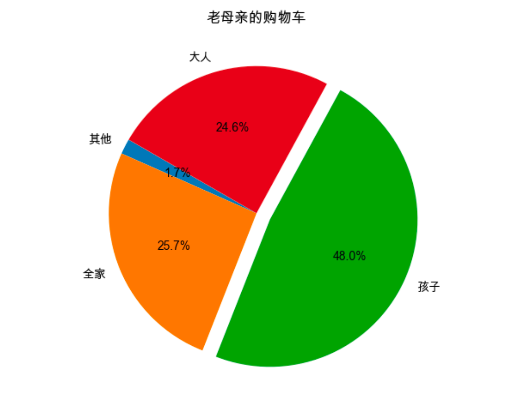

## Python组内赛 
### 主题：双十一 && 2020.11月 
#### 赛题1 -  pygame
#### 赛题2-  第2年课程库（jieba + WordCloud + os + matplotlib）

>[词云](ShopCartWorldCloud.py)
>>
>
>
>[统计图（饼图）](ShopCartMatplot.py)
>>
---
### 遇到的问题
#### 1、解决mac下不显示中文的问题
##### 网上的解决方案一，在mac下无效（也许windows下有效）
```
import matplotlib as plt
plt.rcParams['font.sans-serif']=['SimHei'] #显示中文标签
plt.rcParams['axes.unicode_minus']=False   #这两行需要手动设置

```
##### 网上的解决方案二：
第一步：
```
# 查看字体路径，判断是否有SimHei(黑体)存在
import matplotlib    
print(matplotlib.matplotlib_fname())
```
第二步：下载字体，拷贝到第一步的路径中

第三步：修改matplotlibrc文件
```
 # 文件位置：/users/***/***/matplotlib/mpl-data/matplotlibrc

 font.family         : sans-serif   
 # 去掉前面的#     
 font.sans-serif     : SimHei, Bitstream Vera Sans, Lucida Grande, Verdana, Geneva, Lucid, Arial, Helvetica, Avant Garde, sans-serif  
 # 去掉前面的#，并在冒号后面添加SimHei
 axes.unicode_minus  : False
 # 去掉前面的#，并将True改为False
```
仍然无效

##### 网上的解决方案三——使用mac自带的中文字体
```
# 查看系统可用字体
from matplotlib.font_manager import FontManager
fm = FontManager()
mat_fonts = set(f.name for f in fm.ttflist)
print mat_fonts
```
```
# 重点，终极解决方案
import numpy as np
import matplotlib.pyplot as plt
plt.rcParams['font.sans-serif'] = ['Arial Unicode MS']
```